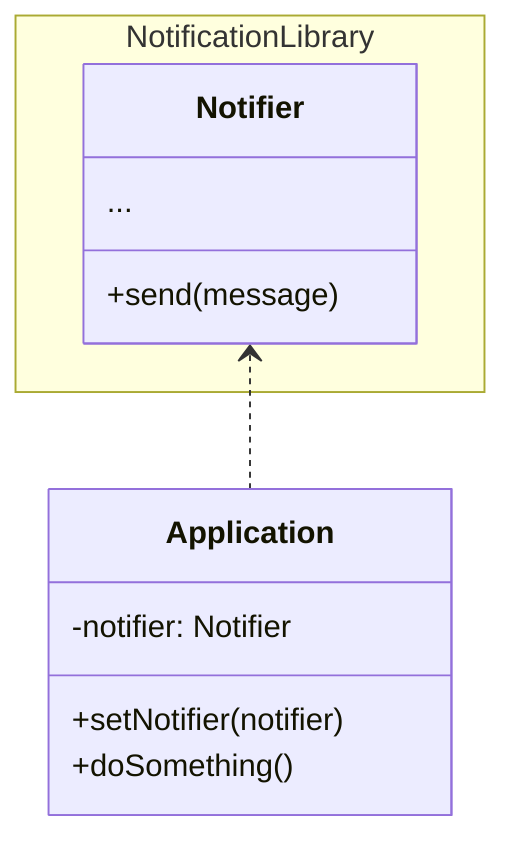
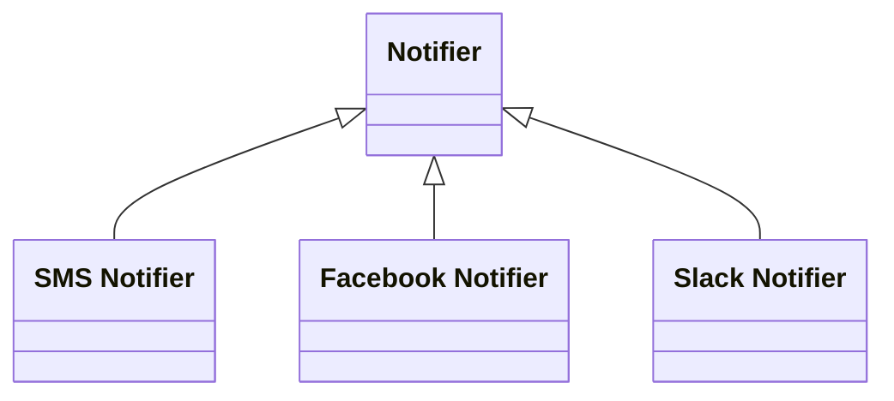
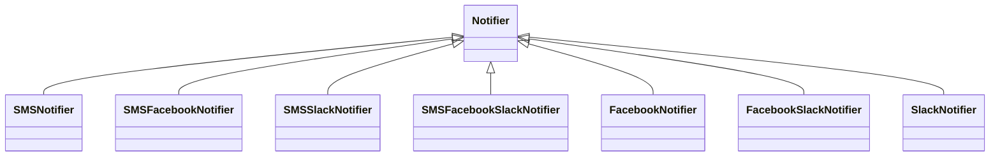
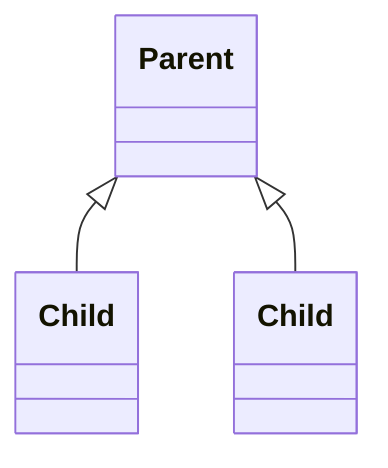
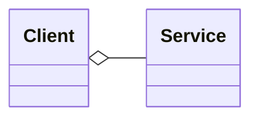
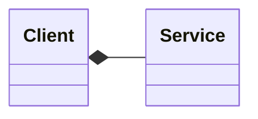
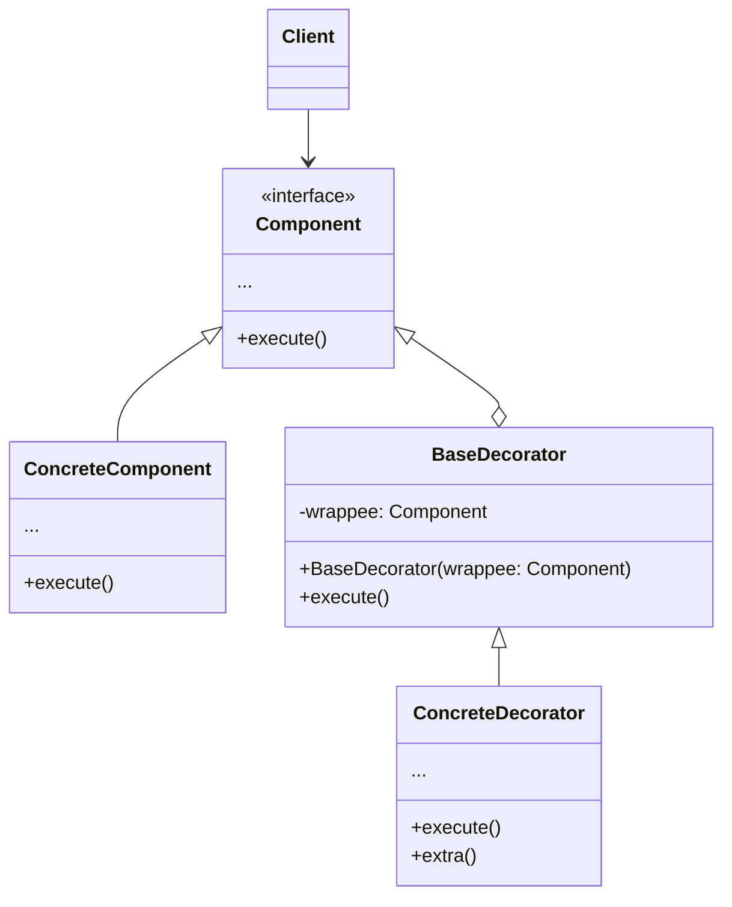
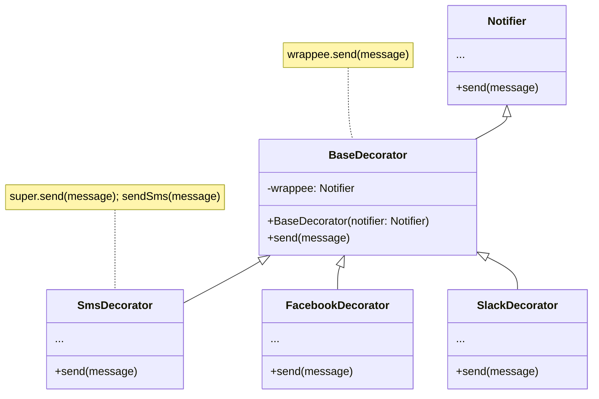

# Decorator

---
layout: "center-diagram"
---

## Problem

Imagine that you're working on a notification library which lets other
programs notify their users about important events.

::diagram::



---
layout: "center-diagram"
---

## A naive solution

How hard could it be? Just implement each notification type as a `Notifier`
subclass.

::diagram::


::footer::

<v-click>
But then someone reasonably asked you:

> "Why can't you use several notification types at once?
> If your house is on fire, you'd probably want to be informed through every channel."
</v-click>

---
layout: "center-diagram"
---

Surely you can create more subclasses that combine different notifiers?

::diagram::



::footer::

<div class="flex justify-center">
    <div>
        
    </div>
</div>

---

### Problems of inheritance

Extending a class is the first thing that comes to mind when you need to alter an object's
behavior. However, inheritance has several serious caveats that you need to be aware of.

<v-clicks>

- Inheritance is static. You can't alter the behavior of an existing object at runtime.
You can only replace the whole object with another one that's created from a different subclass.
- Subclasses can have just one parent class. In most languages, inheritance doesn't let
a class inherit behaviors of multiple classes at the same time.

</v-clicks>

---
layout: "BetterTwoColsHeader"
---

## An actual solution

One of the ways to overcome these caveats is to use **Aggregation**/**Composition**
instead of **Inheritance**.

::left::

### Inheritance



::right::

### Aggregation

The client contains the service, but the service can live
without the client.



### Composition

The client consists of the service, the client manages the lifecycle
of the service, **the service can't live without the client.**



---

## Wrapper

**Wrapper** is an alternative nickname for the **Decorator** pattern
that clearly expresses the main idea of the pattern.

<v-click>When does a wrapper become a real decorator?</v-click>

---
layout: "two-cols"
---

### A general class diagram



::right::

<v-clicks>

- The `Component` declares the common interface for both wrappers and wrapped objects.
- `ConcreteComponent` is a class of objects being wrapped. It defines the basic behavior,
which can be altered by decorators.
- The `BaseDecorator` class has a field for referencing a wrapped object. The field's
type should be declared as the component interface so it can contain both concrete
components and decorators. The base decorator delegates all operations to the wrapped object.
- `ConcreteDecorator` defines extra behaviors that can be added to components dynamically.
They override methods of the base decorator and execute their behavior either before
or after calling the parent method.
- The `Client` can wrap components in multiple layers of decorators, as long as it works
with all objects via the component interface.

</v-clicks>

<style>
  .slidev-layout ul li {
    font-size: 0.92em;
    line-height: 1.66em;
  }
</style>

---

## Real-life analogy


::div{class="text-center"}
*You get a combined effect from wearing multiple pieces of clothing.*
::

---
layout: "center-diagram"
---

### Re-implementing the `Notifier` with decorators

::diagram::



---

Apps can configure complex stacks of notification decorators.

````md magic-move
```java
notifier = new Notifier()

if (smsEnabled && facebookEnabled && slackEnabled)
    notifier = new SmsFacebookSlackNotifier()
else if (smsEnabled && facebookEnabled)
    notifier = new SmsFacebookNotifier()
else if (smsEnabled && slackEnabled)
    notifier = new SmsSlackNotifier()
else if (facebookEnabled && slackEnabled)
    notifier = new FacebookSlackNotifier()
else if (smsEnabled)
    notifier = new SmsNotifier()
else if (facebookEnabled)
    notifier = new FacebookNotifier()
else if (slackEnabled)
    notifier = new SlackNotifier()

app.setNotifier(notifier)
app.getNotifier().send("Alert!") // Email -> Facebook -> Slack
```

```java
notifier = new Notifier()

if (facebookEnabled)
    notifier = new FacebookDecorator(notifier)

if (slackEnabled)
    notifier = new SlackDecorator(notifier)

app.setNotifier(notifier)
app.getNotifier().send("Alert!") // Email -> Facebook -> Slack
```
````

---
layout: "BetterTwoColsHeader"
---

## Pros and cons

::left::

✔ Extend an object's behavior without making subclasses

✔ Add or remove responsibilities from an object at runtime

✔ Combine several behaviors by wrapping an object into multiple decorators

✔ **Single Responsibility Principle**: Divide a monolithic class that implements
many possible variants of behavior into several smaller classes.

::right::

❌ Hard to remove a specific wrapper from the stack

❌ Hard to implement a decorator that doesn't depend on its placement on the
stack

❌ The initial configuration code may look ugly

---

## Real world applications

In many web frameworks, decorators are used to wrap HTTP requests to add
behaviors like logging, authentication, or body parsing. These are commonly
called **middleware**:

```typescript
const app = new Hono()

// Log any incoming requests
app.use(logger())

// Add authentication for any routes under /posts
app.use("/posts/*", basicAuth())

app.get("/", (c) => {
  return c.text("Hello world!")
})

app.get("/posts", (c) => {
  return c.text("You can't access this without authentication!")
})

export default app
```

---

In many OOP languages, I/O streams are just a giant collection of decorators;
streams can be wrapped to modify how data is read or written. In the example
below, a file stream is wrapped to compress the data written to it with `gzip`:

```csharp
using var original = File.Open("original.txt", FileMode.Open);
using var compressed = File.Create("compressed.gz");
using var compressor = new GZipStream(compressed);

original.CopyTo(compressor);
```

Similarly, you can read from a `GZipStream` to read out uncompressed data
from a compressed file:

```csharp
using var compressed = File.Open("compressed.gz", FileMode.Open);
using var decompressor = new GZipStream(compressed, CompressionMode.Decompress);
using var original = File.Create("original.txt");

decompressor.CopyTo(original);
```
