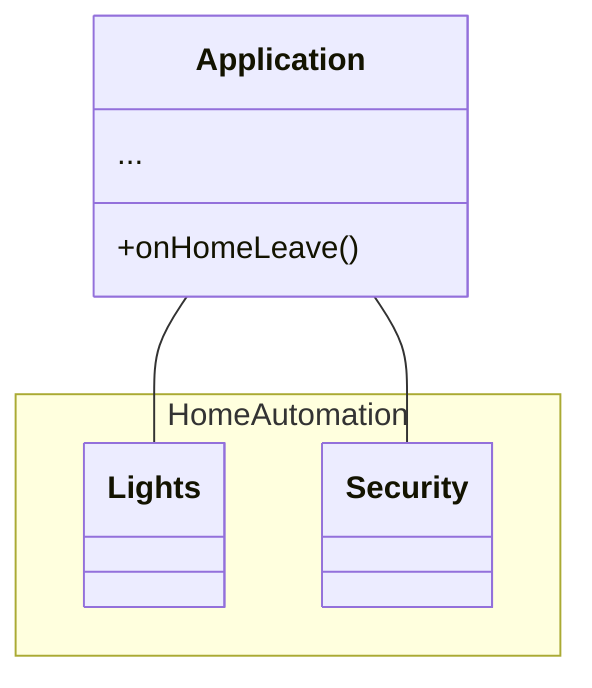
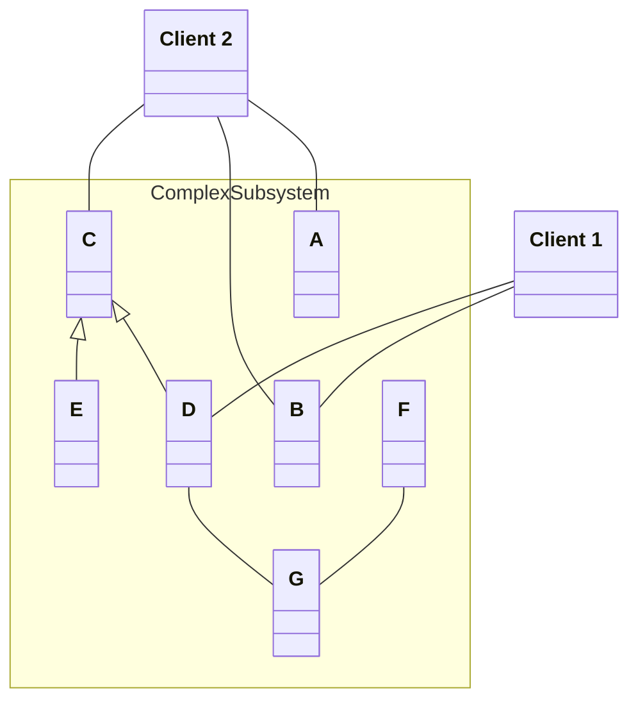
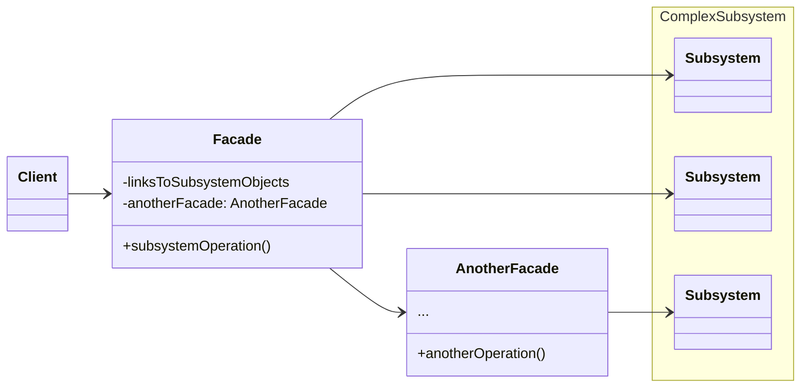
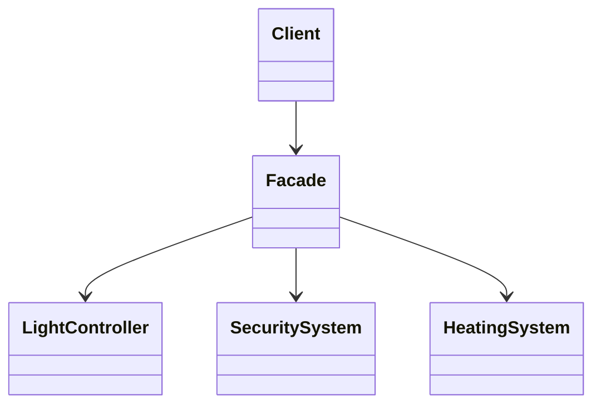
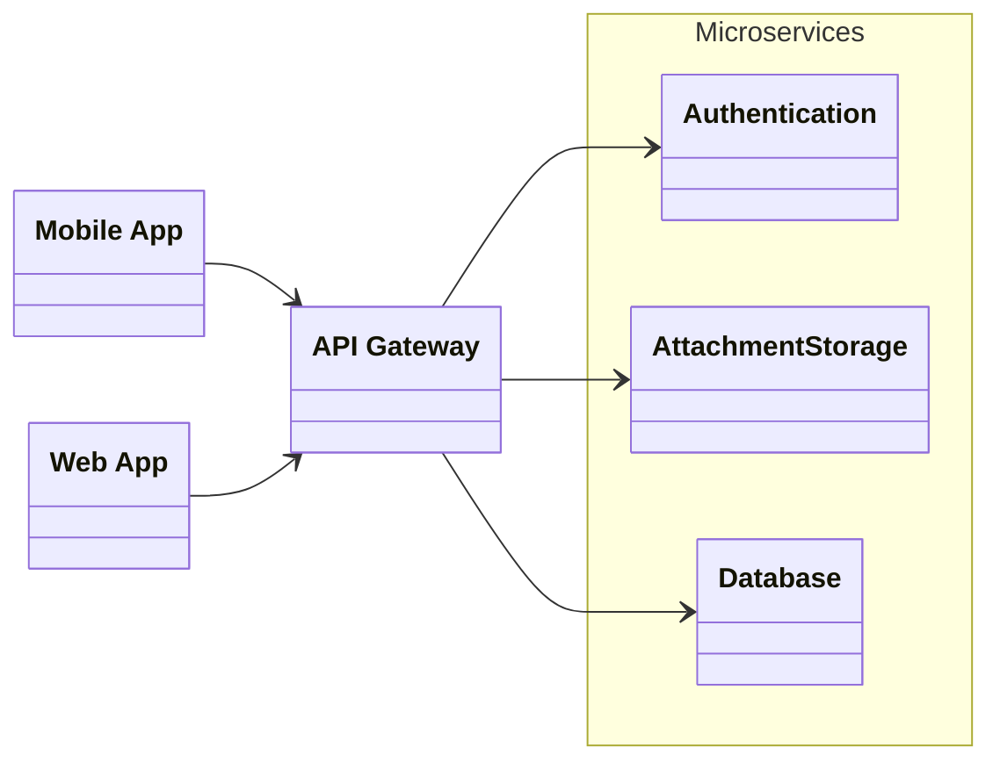

# Facade

---
layout: "center-diagram"
---

## Problem

Suppose that you're building a home automation system that controls
lighting, security, heating, and entertainment devices. To activate or 
deactivate different parts of the system, the user needs to interact with 
multiple components.

::diagram::

---
layout: "center-diagram"
---

## A naive solution

Let the user manually control each component separately. The main application
code calls methods on each system to perform a specific action (turning off the lights,
activating the security, etc.)

::diagram::

---

### Problems with the naive solution

<v-clicks>

- **Complexity**: The application code has to handle the individual logic for each subsystem.
- **Tight Coupling**: The application is tightly coupled to specific classes within each subsystem, making it difficult to modify or replace subsystems independently.
- **Reduced Flexibility**: Users must understand the interactions between various subsystems, which can be overwhelming.
- **Maintenance Overhead**: Changes to any subsystem require changes in every place it’s used.

</v-clicks>

---
layout: "center-diagram"
---

## An actual solution

One of the ways to overcome these problems is to use the **facade** pattern. The facade
pattern helps by providing a single, simplified interface for a set of interfaces within
a subsystem. Instead of interacting with multiple components individually, the
client interacts with a Facade class that encapsulates the interactions with 
each component.

::diagram::

---

## Real-life analogy

::div{class="text-center"}
*Placing orders by phone.*
::

---
layout: "center-diagram"
---

## Re-implementing a home automation system with facades

::diagram::

---
layout: "BetterTwoColsHeader"
---

## Pros and cons

::left::
✔ Simplifies complex systems by providing a single interface.

✔ Reduces coupling between clients and subsystems.

✔ Improves readability and usability of code for the client.

::right::
❌ Adds an additional layer that could lead to more code.

❌ Limited flexibility if the client requires direct access to the subsystems for more specific functionalities.

---
layout: "center-diagram"
---

## Real world applications

In web development, an API gateway is a facade that abstracts away microservices
such as authentication, object storage, data management.

::diagram::

---
layout: "center-diagram"
---

In systems programming, the details of the hardware are usually abstracted
away from the kernel and the operating system. On Windows, this facade is called
the HAL (Hardware Abstraction Layer).

::diagram::

---
transition: "fade"
---

## Quiz

What does the Facade Pattern do?

A. Adds complexity to the system

B. Provides a simple interface to a complex system

C. Removes classes from the system

D. Increases subsystem dependencies

---
hideInToc: true
---

## Quiz

What does the Facade Pattern do?

A. Adds complexity to the system

**B. Provides a simple interface to a complex system**

C. Removes classes from the system

D. Increases subsystem dependencies

---
transition: "fade"
hideInToc: true
---

## Quiz

Which is a drawback of the naive solution in our example?

A. Simplified client code

B. Reduces coupling

C. Complex and tightly coupled client code

D. Easier maintenance

---
hideInToc: true
---

## Quiz

Which is a drawback of the naive solution in our example?

A. Simplified client code

B. Reduces coupling

**C. Complex and tightly coupled client code**

D. Easier maintenance

---
transition: "fade"
hideInToc: true
---

## Quiz

Which layer interacts with the Facade?

A. Subsystems

B. Database

C. Client

D. None of the above

---
hideInToc: true
---

## Quiz

Which layer interacts with the Facade?

A. Subsystems

B. Database

**C. Client**

D. None of the above

---
transition: "fade"
hideInToc: true
---

## Quiz

Which pattern encapsulates complex subsystems behind a single interface?

A. Factory

B. Adapter

C. Facade

D. Observer

---
hideInToc: true
---

## Quiz

Which pattern encapsulates complex subsystems behind a single interface?

A. Factory

B. Adapter

**C. Facade**

D. Observer
